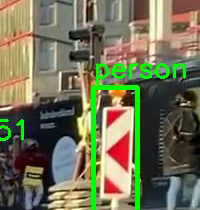

# EdgeVision

Person detection + zone alerting for a security camera use case, with a benchmark comparing FP32, INT8 (dynamic and static), and FP16 quantized inference on CPU.

## Quick start

1. [/demo](https://edgevision-mpll.onrender.com/demo): upload any photo with people in it, see the real ONNX YOLOv8 model detect them live with no setup needed.
2. [/docs](https://edgevision-mpll.onrender.com/docs): interactive API reference, try any endpoint directly in the browser.
3. [/live](https://edgevision-mpll.onrender.com/live): real-time webcam view (only works when running the server locally with a webcam attached, the deployed version has no camera, so this will show a connection error there).

The deployed instance is on Render's free tier, which spins down after inactivity, so the first request after a while may take 20-30s to wake up.

## What it does

A video frame arrives, a detector finds people, a lightweight tracker links detections across frames into persistent identities, tracked boxes get checked against a zone, and alerts get deduped through Redis before hitting a websocket. This includes a standalone image-upload endpoint for zero-setup testing, a live in-browser view for local webcam testing, and a separate benchmark script for testing whether quantizing a model helps on CPU.

## Accuracy

Evaluated `OnnxDetector` (real yolov8n.onnx) against a 200-image labeled subset of COCO val2017 (person class only, seeded sample, see `scripts/fetch_coco_subset.py`), matching predictions to ground truth via IoU ≥ 0.5, with a bootstrapped 95% CI at each threshold (`scripts/check_accuracy.py`):

| conf threshold | precision [95% CI] | recall [95% CI] | tp | fp | fn |
|---|---|---|---|---|---|
| 0.25 | 0.814 [0.768, 0.861] | 0.628 [0.584, 0.673] | 553 | 126 | 328 |
| 0.40 (default) | 0.888 [0.846, 0.928] | 0.531 [0.486, 0.579] | 468 | 59 | 413 |
| 0.50 | 0.919 [0.884, 0.952] | 0.476 [0.431, 0.524] | 419 | 37 | 462 |
| 0.60 | 0.953 [0.926, 0.976] | 0.410 [0.366, 0.458] | 361 | 18 | 520 |

There is a monotonic precision/recall tradeoff as the threshold rises with fewer false alarms, but more missed people. For a security-camera use case a missed person is usually worse than a false alarm, which argues for running below the library default of 0.4, closer to 0.25, trading some false-positive noise for meaningfully better recall.

The widened 200-image run confirmed the original 40-image numbers (all four thresholds landed within ~1-2 points of precision/recall on the original small sample). Every interval above is under 9 points wide, and none cross into ambiguous territory (e.g. 0.40's precision CI is [0.846, 0.928]).

**Confidence interval methodology:** `bootstrap_ci()` resamples at the image level (not per-detection, since detections inside one image are correlated, so a badly-lit or crowded image drags every detection in it down together, images are the actual i.i.d. sampling unit). This benchmark does 2000 resamples, the image-indices drawn with replacement, precision/recall recomputed per resample, 2.5th/97.5th percentiles taken as the interval. The point estimate reported is the aggregate from the actual data, not the mean of the resamples. The resamples characterize spread around that number, they don't replace it. Verified this bootstrap against an independent, non-vectorized reference implementation with a different RNG agreeing to within 0.02 on the same data, plus deterministic sanity checks (a single image or every identical images must both collapse the CI to exactly zero width in `tests/test_check_accuracy.py`).

`coco_subset/` is gitignored, regenerate with `python scripts/fetch_coco_subset.py`.

Two annotated real-image spot checks are included: (`results/examples/`): `bus.jpg` (4 people in frame, all 4 found) and `zidane.jpg` (2 people, both found).

### Observations

- **A false positive on a tall, narrow, high-contrast object:** a red/white striped traffic bollard got boxed as `person`:

  

  Consistent with the aggregate false-positive rate from the accuracy table above. A real deployment would want either a higher confidence threshold in crowded scenes, or a second-stage filter (like minimum aspect ratio) to catch shape outliers like this.

- **Zero detections on extremely dense crowd photos:** Uploading a wide festival-crowd photo (hundreds of people, each only a few pixels tall after the model's 640x640 letterbox resize) to `/demo/detect` returns no boxes at all. This is because single-shot detectors like YOLO lose the ability to detect objects below a certain pixel footprint, and is why dedicated crowd-counting models exist (density estimation rather than per-instance boxes). To improve crowded image detection, use tiled/sliding-window inference, in which you split the image into overlapping crops, detect per crop, and merge results, rather than downscaling the whole frame at once.

Full annotated video output: `results/video/street_annotated.mp4`, generated via `python -m scripts.test_video` against a free, licensed street-scene clip (["A bustling day with pedestrians crossing a vibrant city street"](https://www.pexels.com/video/people-walking-on-the-street-3552510/) by Marc Van den Broeck, Pexels License). 

### Live-view latency

The `/live` browser view and the `/ws/detections` websocket both report a per-frame timing breakdown (`read_ms`, `detect_ms`, and `encode_ms` when frames are included). The pipeline is fully serial: read a frame, run inference, JPEG-encode it, send it, wait for the next request-response cycle to draw it, with no frame buffering or threading decoupling capture from inference. Perceived lag in `/live` shows real per-frame inference time (~150-250ms with the ONNX backend on CPU). A production system would decouple capture and inference with a frame queue to smooth this out, but in this project it's kept simple.

## Tracking

Added a lightweight IoU/centroid tracker on top of raw per-frame detection, which fixed the box-flicker effect found earlier. Instead of every frame being detected in isolation, `Tracker.update()` links detections across frames into persistent tracked boxes with their own `track_id`. The websocket payload and zone-alerting key off tracked detections (not raw ones).

### Tracking algorithm

Tracking uses two rounds of greedy matching per frame, first by IoU (cheap, scale-aware but degrades to zero once two boxes stop overlapping), then by centroid-distance as a fallback for the leftovers. Centroid distance handles cases where motion ebtween frames outruns IoU's overlap requirements. Uses greedy assignment because for this project optimal-assignment cases are rare and not worth a dependency for the Hungarian algorithm.

Matching includes `min_hits`/`max_age` to measure each tracks state. A new detection starts as an unconfirmed tentative track and only becomes a reported and alertable identity after `min_hits` consecutive matches, which stops single frame false positives from getting an ID. A track that stops matching is held for `max_age` consecutive frames before it's dropped, allowing tracked boxes to survive some brief occlusion without losing the id entity.

### Tuning on testing footage

`iou_threshold` and `max_age` started at (0.3, 8) and were retuned after running `scripts/diagnose_tracking.py` and `scripts/diagnose_fragmentation.py`, which measured the real match-score and occlusion gap distribution for the ONNX detector output on each video, showing how the detector output jitters frame to frame. 

With the original `max_age=8`, 75.8% of all track deaths on video of a crowded street had a plausible same-person rebirth nearby within 1.5s/150px. Measured occlusion gap length (median 18 frames, 75th percentile 31, at 30fps), then set `max_age=30`, which bridges about 74% of observed gaps.
`iou_threshold` dropped from 0.3 to 0.15 after measuring near-miss IoU scores that the original default was silently rejecting. 

`centroid_max_dist` is scaled to 7% of the frame diagonal, and hardcoded alert zone was replaced with a similar resolution-scaled fix in `alerts.py`/`main.py`.

### Dwell, stationary detection, and loitering

On top of persistent track IDs: `dwell_frames()` (how long a track's been visible), `stationary_frames()` (how long since it last actually relocated), and `has_moved()` (whether it's ever relocated at all, which exists to detect false positives).

Both `dwell_frames()` and `stationary_frames()` count frames, not wall-clock seconds, because `Tracker` has no reliable notion of real time between a live websocket stream and an offline video. The caller converts to seconds using `frames / fps` (fps read once from the capture source).

`stationary_frames()` functions using an anchor box. Each track keeps an `anchor_box` set the first time it's seen, and only moves the anchor (resetting the stationary clock) once its centroid has moved further than `stationary_move_threshold_for_resolution()`, default 2% of the frame diagonal, smaller than tracking's default 7% `centroid_max_dist`, since it's answering a different question: "has this thing relocated" vs "is this still probably the same object frame-to-frame."

**`has_moved()` false positive fixes** A static misdetected object never triggers an anchor reset, so by `stationary_frames()` alone it looks identical to a person who's actually lotering, and would eventually cross `LOITERING_SECONDS` and fire an alert. `has_moved()` gates loitering eligibility on the track having relocated at least once since it was first seen (`stationary_since_frame != first_seen_frame`). A sign (like the false positive found in the demo) never moves, so it never passes this gate. A real person almost always shifts position within a few seconds of being confirmed, so they are likely to pass the gate and not trigger a false negative.

This can't distinguish an always-static object from a real person who happened to be standing still already in the very first frame they were ever observed. That edge case would need a longer observation window or a size/aspect-ratio prior.

`app/main.py`'s websocket loop checks `has_moved(track) and stationary_seconds >= LOITERING_SECONDS` for every confirmed track inside the zone, firing a `loitering`-type alert through `AlertManager`. `Alert`/`AlertManager` gained an `alert_type` field (default `"zone_entry"`, backward compatible) so a `zone_entry` and a `loitering` alert for the same zone+label don't collide on the same Redis cooldown key.

`LOITERING_SECONDS = 10.0` is a hardcoded estimated placeholder.`iou_threshold` and `max_age` were retuned against footage.

### Direction-aware entry/exit counting

`EntryExitCounter` (`app/alerts.py`) makes the zone-overlap check every frame already did into entry/exit events by diffing each confirmed track's inside/outside state against what it was last frame. It needs `Tracker.alive_track_ids()` (every track ID the tracker still holds internally, confirmed or not, as long as `misses <= max_age`) to know when to forget a track's state, otherwise it would leak memory on a long-running stream.

Limitations:

- A track's first-ever observation seeds its state, but it doesn't fire an event. A track that's already inside the zone on the first frame it's confirmed is indistinguishable from one that just walked in.
- Because confirmation takes `min_hits` (3) frames, a track walking straight into the zone can already be confirmed while inside it, meaning the entry event gets missed, only the eventual exit shows up. 
- If a track dies (occlusion past `max_age`, or leaves frame) while still inside the zone, no exit event ever fires. `entries - exits` as a live occupancy count will overcount in that case.

Verified with two websocket-pipeline integration tests, using a detector that steps a box 40px/frame (under `centroid_max_dist`'s 56px threshold for a 640x480 frame, so the same track ID survives the crossing) from outside the zone to inside, and the reverse. Confirms the event fires exactly once and `occupancy` reflects it correctly.

### Multi-class detection and the package left/taken compound event

Refactored OnnxDetector to detect more classes than person only. HogPersonDetector remains person-detection only. `classes: set[str] | None = None` lets a caller request any subset of the 80 COCO class names, defaulting to person-only so every existing caller (`check_accuracy.py`, `diagnose_tracking.py`) behaves exactly as before.

`_nms` was refactored to include label awareness by grouping detections by label before applying the per-call NMS suppression algorithm.

COCO has no literal `box`/`package`/`parcel` class. `PACKAGE_CLASSES = {"backpack", "suitcase", "handbag"}` are the closest available by size/shape, so this is more of a demonstration of the multi-class detection architecture and left-then-take state machine. Would need fine-tuned training data on real delivery packages to fix this.

`PackageMonitor` (`app/alerts.py`) tracks package-class tracks through `left -> taken`: "left" fires once a package has sat stationary in the zone for `PACKAGE_LEFT_SECONDS` and "taken" fires when a previously-flagged package's track is no longer alive. Only "taken" escalates to a real alert (`alert_type="package_taken"`), while "left" stays informational.

Does not gate "left" on `has_moved()` to avoid false negatives from disregarding obscured/existing packages, but allows more oppurtunity for false positives misclassified as the package classes.

### Entryway demo

`results/video/entryway_tracked.mp4` (source: ["Delivery man delivering order"](https://www.pexels.com/video/delivery-man-delivering-order-6667223/) by Kampus Production, Pexels License). Track ID stays stable throughout the clip. Frames 41-47 (~0.28s) briefly show two overlapping tracks for the same person, due to detector producing two candidate boxes for one person with insufficient IoU overlap for NMS threshold to merge them. This self-corrects in 7 frames.

### Crowd demo

`results/video/street_tracked.mp4` is kept as a stress test. It's not what this project is made for, due to the busy crowd with many people obscuring eachother. Even after tuning, tight clusters of adjacent people still produce ID swaps when one briefly occludes another (e.g track `#7` -> `#23` mid-clip). This occurs because greedy IoU/centorid matching has no appearance signal to disambiguate which of several similarly scoring nearby candidates is the same person vs another person standing close by. To fix, you would use learned re-identification embedding (DeepSORT), which would add another model and latency.

## Benchmark

### Demo model (hand-built CNN, all four variants)

`scripts/benchmark.py` builds and benchmarks four variants: FP32 baseline, INT8 dynamic, INT8 static (calibrated, not just dynamic), and FP16. Predictions based on theory:

- **Static should beat dynamic.** Dynamic recomputes each op's activation scale every single inference, while static pre-computes it once from a calibration set, so inference itself pays no calibration cost.
- **FP16 shouldn't help latency on CPU, only size.** FP16's speed win occurs with GPU tensor cores. Most CPUs have no fast native FP16 compute path, so `onnxruntime` must usually upcast back to FP32 internally to actually run the ops, which is a cast cost with no compute benefit.

Demo model, one run in a sandboxed CPU environment (absolute numbers here aren't to be trusted due to noise, only checked for direction):

| variant | size (KB) | mean latency (ms) | p95 (ms) | fps |
|---|---|---|---|---|
| fp32 | 114.3 | 0.530 | 0.632 | 1884.0 |
| int8_dynamic | 33.6 | 0.861 | 0.973 | 1160.0 |
| int8_static | 34.6 | 0.665 | 0.900 | 1502.6 |
| fp16 | 57.9 | 0.567 | 0.660 | 1761.9 |

Size dropped ~70% for int8, but latency didn't improve for either int8 variant. Quantization adds a dequantize step around every op, and on a network this small (a few thousand params) that overhead is bigger than the latency saved doing the matmuls in int8. Both predictions held: int8_static (0.80x fp32 latency) beat int8_dynamic (0.62x) by removing the live calibration cost, and fp16 was 0.94x, basically the same or slightly slower due to the internal cast on CPU. Size dropped ~49% for fp16 as expected with no compute win.

This benchmark runs on a small CNN built by hand with `onnx.helper`. To benchmark a real model, pass `--model` and bump `--input-size` to 640. Weights are seeded so the model itself is identical every run, but the absolute latency numbers move around depending on what else is running on the machine at the time, with swings of 2x+ between a quiet machine and a loaded one. The size reduction and the direction of the int8 latency result (slower on this demo model) were constants across every run though.

HOG on its own runs about 154ms/frame (roughly 6.5fps) at 640px on a regular CPU, averaged over 20 runs after warmup.

### yolov8n (Initial benchmark)

Once yolov8n.onnx was actually exported and the same FP32 vs INT8 comparison reran against it instead of the hand-built demo model, the result flipped:

| variant | size (KB) | mean latency (ms) | fps |
|---|---|---|---|
| fp32 | 12550 | 94.3 | 10.6 |
| int8 | 3422 | 65.6 | 15.2 |

INT8 is 1.44x faster here, because the dequant overhead is roughly fixed per op, but the compute it's saving scales with the model's actual size. On a network this small (a few thousand params) that overhead dominates, while on yolov8n (3.1M params, 8.7 GFLOPs) there's enough matmul work that quantizing it is a net win. A model's compute density is what determines whether quantization helps or hurts latency. 

However, the same comparison on different CPU hardware (AMD Ryzen 5 7520U vs. the machine above) came out the other way, int8 slightly slower (403ms vs 356ms fp32, 0.88x) in an earlier partial run. Quantization's payoff depends on the specific CPU's int8 vs fp32 throughput characteristics, not just the model.

### yolov8n, all four variants (Ryzen 5 7520U)

Full run on Ryzen 5 7520U, all four variants against the real `yolov8n.onnx`:

| variant | size (KB) | mean latency (ms) | p95 (ms) | fps |
|---|---|---|---|---|
| fp32 | 12550 | 178.1 | 185.6 | 5.6 |
| int8_dynamic | 3422 | 208.0 | 250.4 | 4.8 |
| int8_static | 3440 | 226.1 | 314.4 | 4.4 |
| fp16 | 6312 | 149.7 | 166.7 | 6.7 |

*fp32's absolute number moved from 356ms (the intiial benchmark) to 178ms here on the same CPU model and code in a different session, showing the noise present. Ratios between variants within the same run are what's used to compare rather than the absolute ms.*

Both int8 variants were slower than fp32 on this CPU, which is consistent in direction with the initial benchmark, strengthening the idea that this CPU's int8 throughput is less than its fp32 throughput, regardless of which int8 variant.

**int8_static came out slower than int8_dynamic here (0.79x vs 0.86x fp32 latency)** which is the opposite of both the stated prediction (static should beat dynamic by skipping live calibration) and the demo-model result where static did beat dynamic. On yolov8n's larger, conv-heavy architecture, the static graph's QDQ node pattern may not be fusing into efficient int8 execution kernels the way this CPU's dynamic-quant path does, or synthetic-noise calibration (used here since this script measures latency/size, not accuracy, see `RandomCalibrationDataReader`) may be picking clipping ranges that add overhead somewhere the demo model's much smaller graph never exercised. 

**fp16 was faster here (1.19x)** However, this comparison has a confound in that unlike the other three variants which are all derived from the same plain ONNX export via `quantize_dynamic_int8`/`quantize_static`, the fp16 model came from Ultralytics' native export pipeline (`yolo export ... quantize=True`) after `onnxconverter_common`'s post-hoc conversion was found to be broken for this architecture. ONNX's validator rejects converting `Resize`'s scale input to fp16, and the library's boundary-Cast insertion around a correctly-blocked `Resize` is broken for this specific graph. The native export pipeline also ran `onnxslim` (operator fusion, redundant-node elimination) as part of exporting, which the other three variants never received. So this 1.19x is a result of fp16-export-plus-graph-optimization together, not fp16 precision in isolation. This benchmark supports the idea that the natively fp16-exported model was faster, not that fp16 precision helped.Disentangling them would require benchmarking an `onnxslim`-optimized fp32 model too.

See `results/benchmark_real_model.csv` for the full real run.

## Architecture / design decisions

- **Two detectors behind one interface** (`app/detector.py`): `HogPersonDetector` (OpenCV's built-in HOG+SVM, zero setup) and `OnnxDetector` (real YOLOv8 via onnxruntime), both returning the same `Detection` dataclass and `(detections, elapsed_time)` tuple, swappable via `DETECTOR_BACKEND` env var. A shared `draw_detections()` helper lives next to `Detection` so the box/label drawing style is defined once, not copy-pasted across `scripts/test_video.py`, `/demo/detect`, and anywhere else that needs it.
- **API key auth on `/demo/detect` and `/ws/detections`**, off by default. Set API_KEY for deployment, local dev needs nothing. HTTP uses an X-API-Key header, the websocket uses a ?api_key=... query param instead, since browser WebSocket clients have no way to set custom headers at all. Both compare with secrets.compare_digest, not ==, to avoid a timing side-channel on the secret comparison. Websocket's auth check is the first route dependency so it short circuits before `get_frame_source()` can open a real video source for an unauthorized connection.
- **Drawing code lives in its own module** (`app/drawing.py`), not inside `detector.py`/`tracker.py`, because `draw_detections()` and `draw_tracks()` are the only things in the codebase that need `cv2`/`numpy` purely for visualization, so tracking's matching logic stays  testable in isolation.
- **Tracking is a lightweight IoU/centroid greedy matcher** not a heavier learned tracker.
- **Letterbox resize, not stretch-resize**, before feeding frames to the ONNX model the pipeline scales them to fit while preserving aspect ratio, pads the rest with grey, then undoes the scale+pad math on the output boxes. A straight resize would distort people's proportions and hurt accuracy. This is also the root cause of the dense-crowd failure mode above where the whole frame, including every tiny distant person, gets scaled down together.
- **NMS threshold of 0.45** for collapsing duplicate overlapping boxes for the same person, applied after class-filtering to person-only, vectorized with NumPy rather than a per-box Python loop (8400 candidate boxes per frame would otherwise dwarf the model's own inference time on CPU). This also causes the brief double detection on the entryway demo.
- **Redis for alert dedup**, via `SET NX EX` giving a 30-second cooldown per zone+label with no separate cleanup job needed, the key expires on its own.
- **Dependency injection via FastAPI's `Depends()`** (`app/dependencies.py`): the detector, Redis client, alert manager, and video frame source are all constructed through cached factory functions rather than bare module-level globals, so tests can cleanly swap in fakes (`fakeredis`, a stub detector, stub frame source) via `app.dependency_overrides` without touching route code. The `lifespan` context manager eagerly builds and pings these at startup (fail fast if the model file's missing or Redis is unreachable) rather than lazily on the first request. The frame source is not cached like the others, because each websocket connection needs its own `VideoCapture` handle.
- **Multi-stage Docker build**: a throwaway `builder` stage installs `ultralytics`/`torch` just long enough to export `yolov8n.onnx`, then the actual runtime image only inherits that one resulting file via `COPY --from=builder`. `torch` never ships in what's actually deployed.
- **`POST /demo/detect`** returns either an annotated JPEG or a JSON detection list (`format` query param), so it works both as a quick visual check and as a properly testable API from `/docs`. This is also the only endpoint that works against the live deployment with zero local setup, since it doesn't need a webcam or a persistent connection.

## Tests

80 tests, `pip install pytest fakeredis && pytest tests/ -v`:
- `test_detector.py`: NMS (suppression, survival, empty input, partial overlap below threshold, overlapping classes/labels, OnnxDetector configurable classes)
- `test_tracker.py`: track confirmation gating (`min_hits`), surviving a one-frame gap under the same ID, expiry after `max_age` consecutive misses, two well-separated tracks not swapping IDs, a track's label/confidence reflecting the real matched detection rather than a placeholder, `stationary_frames`/`has_moved`, and `alive_track_ids()` across unconfirmed/gapped/expired tracks
- `test_alerts.py`: `Zone.overlaps_box`'s four separation directions plus edge-touching, `AlertManager`'s cooldown/dedup logic via `fakeredis` (including per-`alert_type` cooldown separation), and `EntryExitCounter`'s entry/exit/no-event/pruning/multi-track cases and `PackageMonitor's` left/taken state machine
- `test_main.py`: FastAPI route coverage (`/health`, `/alerts/recent`) via `TestClient`, API-key auth on `/demo/detect` and websocket, plus integration tests through the websocket route: a detection crossing the zone firing an alert and landing in `/alerts/recent` (`test_alert_full_pipeline`), loitering firing/not-firing for a moving-then-still vs always-static track, and entry/exit events + occupancy counts firing correctly for a track walking into and out of the zone, a package being detected and taken properly
- `test_check_accuracy.py`: `bootstrap_ci()` degenerate cases collapsing to exactly zero-width CIs (single image or all images identical), the point estimate being the real aggregate independent of seed/resample count, agreement with an independent non-vectorized reference implementation, a wider sample producing a tighter interval, and the zero-denominator resample edge case resolving to 0.0 instead of crashing
- `test_benchmark.py`: `RandomCalibrationDataReader`'s contract, it must yield exactly `num_samples` samples then `None`, correct shape/dtype/key per sample

## Running it

```
docker compose up --build
curl http://localhost:8000/health
```

For a real webcam it's easier to skip Docker and just run it locally. Needs Redis installed or running via `docker run -d -p 6379:6379 redis:7-alpine`:

```
pip install -r requirements.txt
uvicorn app.main:app --reload
```
then go to `http://localhost:8000/live` in a browser with `VIDEO_SOURCE=0` set, or connect a websocket client directly to `ws://localhost:8000/ws/detections`.

Auth is off by default, but for deployment set API_KEY and include it in every request: `curl -H "X-API-Key: <key>" -F file=@image.jpg http://localhost:8000/demo/detect` and `ws://localhost:8000/ws/detections?api_key=<key>` for the websocket (a query param for the API key rather than a header because browser WebSocket clients can't set custom headers).

For the ONNX backend outside Docker:
```
pip install ultralytics
cd models && yolo export model=yolov8n.pt format=onnx imgsz=640
```
(Docker handles this automatically via the multi-stage build, this is only needed for running the export locally outside a container.)

### Deployed version

The live Render deployment runs the ONNX backend (`yolov8n.onnx`, bundled into the image at build time) with a managed Redis instance, provisioned via `render.yaml` as a Blueprint. No `VIDEO_SOURCE` is set (no camera on a cloud server), so `/health`, `/docs`, `/demo`, `/demo/detect`, `/alerts/recent`, and `/benchmark/results` all work, but `/live` and `/ws/detections` have nothing to stream from there.

## What this isn't

This is a benchmarking harness and an alerting service, not an on-device deployment. It runs on a regular CPU through onnxruntime and doesn't target any specific camera SoC, NPU, or cross-compiled runtime. It's also not a crowd-counting system. Dense-crowd scenes are a known failure mode.

## TODO / known gaps

- HOG is not very accurate, it's there because it needs no download. I would use the ONNX path for anything real
- some tests in `test_main.py` rely on an earlier test in the file warming up the `@lru_cache`'d redis-client dependency, so running a single test from that file in isolation (rather than the full file/suite) can fail
- alert history is just whatever's in Redis's bounded list, nothing persisted long term
- single camera only right now
- zone is still a computed default (`default_zone_for_resolution`), not yet user-configurable per camera. It's correct across resolutions but a real deployment would want this drawn by a user in a setup UI, not any default at all
- dense-crowd scenes are still a limitation for a motion-only tracker, to fix would add re-identification embedding.
- tiled/sliding-window inference for dense-crowd detection (as opposed to tracking) also not yet tried